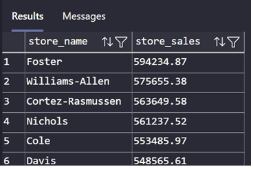

## Sales Performance

### Requirement

* Total Revenue: Total revenue generated

---

```sql
SELECT SUM(total_sales) Total_revenue FROM gold.vw_fact_sales_summary
```

---


---

* Total orders:

```sql
SELECT COUNT(sales_orders) AS total_orders FROM gold.vw_fact_sales_transactions;
```

---


---

* Total Quantity Sold

```sql
SELECT SUM(total_quantity) AS total_quantity_sold FROM gold.vw_fact_sales_summary;
```

---


---

* Sales Trend Over Time (Year-Month)

```sql
SELECT year, month, SUM(total_sales) AS monthly_sales 
FROM gold.vw_fact_sales_summary 
GROUP BY year, month 
ORDER BY CAST(CONCAT(month, ' 1, ', year) AS DATE);
```

---


---

* Sales by Store (Top-Performing Stores)

```sql
SELECT
    s.store_name,
    SUM(fs.total_sales) AS store_sales
FROM gold.vw_fact_sales_summary fs
JOIN silver.csv_stores s ON fs.store_id = s.store_id
GROUP BY s.store_name
ORDER BY store_sales DESC;
```

---



---

* Sales by Product (Top-Performing Products)

```sql
SELECT 
    p.product_name,
    SUM(fs.total_sales) AS product_sales
FROM gold.vw_fact_sales_summary fs
JOIN silver.csv_products p ON fs.product_id = p.product_id
GROUP BY p.product_name
ORDER BY product_sales DESC;
```

---


---

* Average Order Value (AOV)

```sql
SELECT 
    SUM(total_price) * 1.0 / COUNT(DISTINCT sales_orders) AS avg_order_value
FROM gold.vw_fact_sales_transactions;
```

---


---

* Top 10 Products by Quantity Sold

```sql
SELECT TOP 10
    p.product_name,
    SUM(fs.total_quantity) AS units_sold
FROM gold.vw_fact_sales_summary fs
JOIN silver.csv_products p ON fs.product_id = p.product_id
GROUP BY p.product_name
ORDER BY units_sold DESC;
```

---


