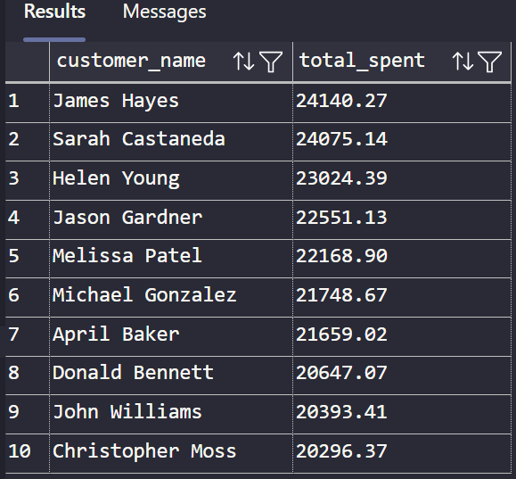
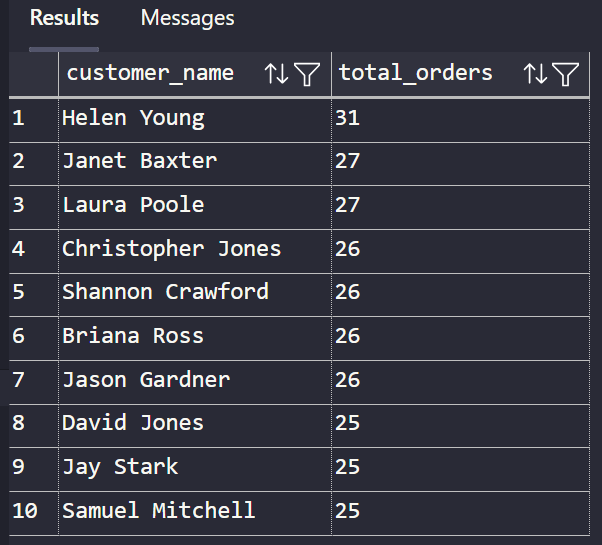
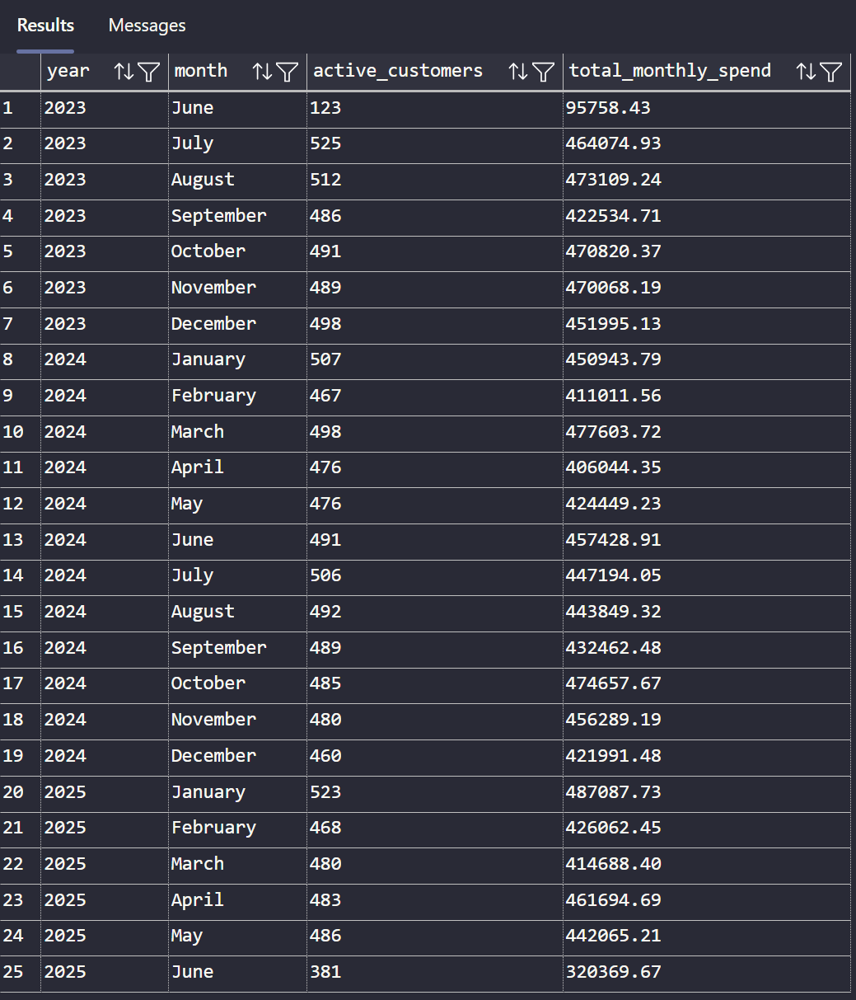
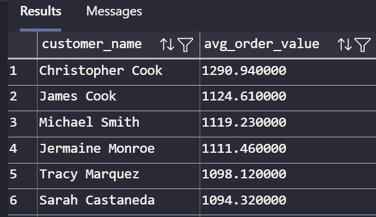
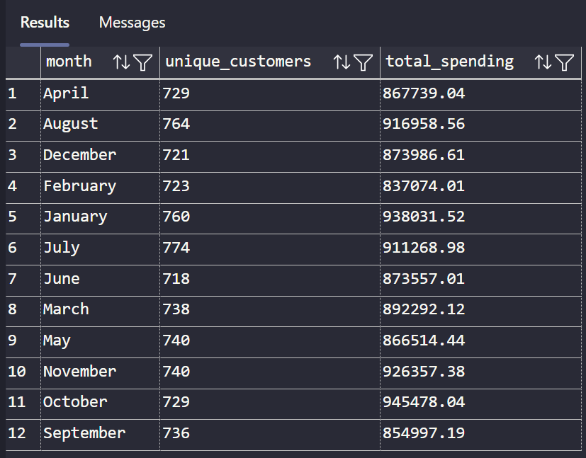

# Customer Insight

## Requirement

- Top 10 High-Value Customers by Total Spend

```sql
SELECT TOP 10 
    customer_name,
    total_spent
FROM gold.vw_dim_customer_value
ORDER BY total_spent DESC;
```



- Customer Frequency (Most Orders)

```sql
SELECT TOP 10 
    customer_name,
    total_orders
FROM gold.vw_dim_customer_value
ORDER BY total_orders DESC;
```



- Monthly Purchase Trend by Customer

```sql
SELECT 
    year,
    month,
    COUNT(DISTINCT customer_id) AS active_customers,
    SUM(total_spent) AS total_monthly_spend
FROM gold.vw_fact_customer_monthly_summary
GROUP BY year, month
ORDER BY 
    CAST(CONCAT(month, ' 1, ', year) AS DATE);
```



- Average Order Value by Customer Segment

```sql
SELECT 
    customer_name,
    ROUND(total_spent * 1.0 / NULLIF(total_orders, 0), 2) AS avg_order_value
FROM gold.vw_dim_customer_value
ORDER BY avg_order_value DESC;
```



- Seasonal Trend in Customer Purchases

```sql
SELECT 
    month,
    COUNT(DISTINCT customer_id) AS unique_customers,
    SUM(total_spent) AS total_spending
FROM gold.vw_fact_customer_monthly_summary
GROUP BY month
ORDER BY month;
```


