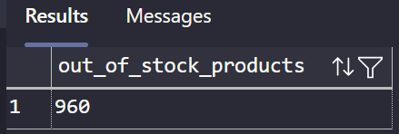
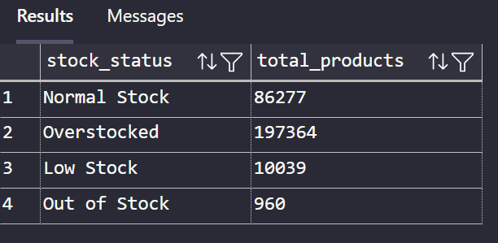
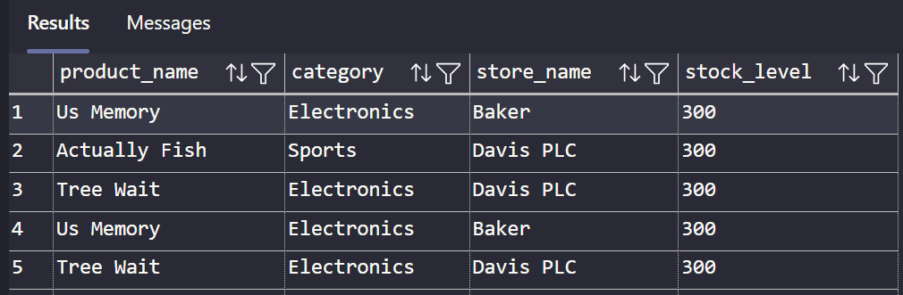
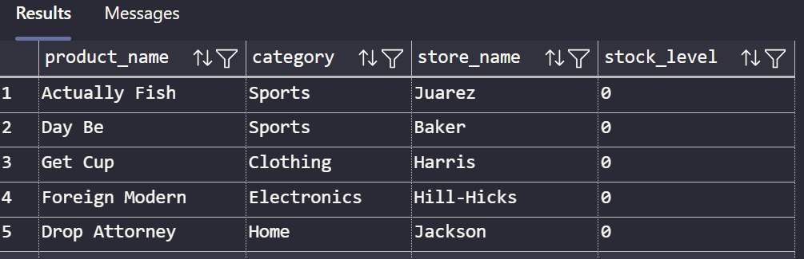

# Story 3: Inventory & Stock Levels Dashboard

## Requirement

- Total Products Out of Stock

```sql
 SELECT COUNT(*) AS out_of_stock_products
FROM gold.vw_fact_inventory_snapshot
WHERE stock_status = 'Out of Stock';
```



- **Products by Stock Status**

```sql
sql
CopyEdit
SELECT
    stock_status,
    COUNT(*) AS total_products
FROM gold.vw_fact_inventory_snapshot
GROUP BY stock_status;

```



- **Top 10 Overstocked Products**

```sql
sql
CopyEdit
SELECT TOP 10
    product_name,
    category,
    store_name,
    stock_level
FROM gold.vw_fact_inventory_snapshot
WHERE stock_status = 'Overstocked'
ORDER BY stock_level DESC;

```



- **Low Stock or Critical Items**

```sql
sql
CopyEdit
SELECT
    product_name,
    category,
    store_name,
    stock_level
FROM gold.vw_fact_inventory_snapshot
WHERE stock_status IN ('Out of Stock', 'Low Stock')
ORDER BY stock_level ASC;

```



- **Stock Level by Category**

```sql
sql
CopyEdit
SELECT
    category,
    SUM(stock_level) AS total_stock
FROM gold.vw_fact_inventory_snapshot
GROUP BY category
ORDER BY total_stock DESC;

```


